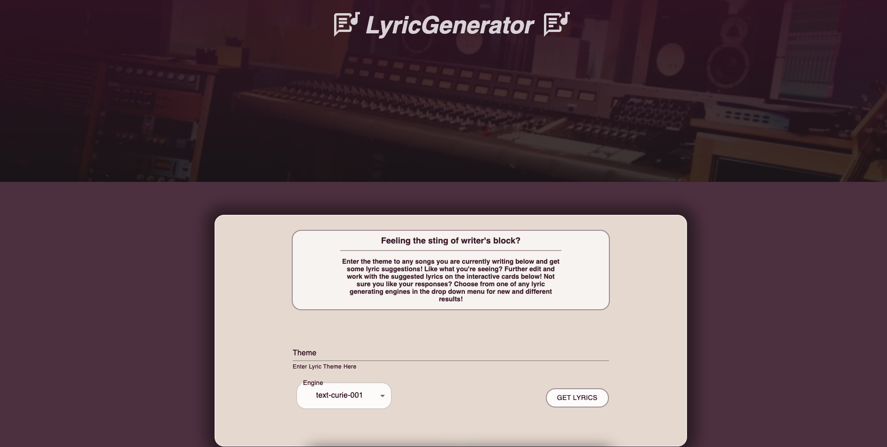

# Shopify Front end intern challenge fall 2022

## Built by
- Blain Crawford

## Deployed at
https://shopify-front-end-intern-challenge.netlify.app/

An application that sends plain text to the <a href="https://openai.com/api/" target="_blank">OpenAI API</a> and displays results in a list.  

## Technologies used
- <a href='https://www.javascript.com/'>JavaScript</a>
- <a href='https://reactjs.org/'>React</a>
- <a href="https://mui.com/">Material UI</a>
- <a href="https://www.npmjs.com/package/axios">axios</a>
- <a href='https://webpack.js.org/'>webpack</a>
- <a href='https://code.visualstudio.com/'>Visual Studio Code</a>
- <a href='https://github.com/blain-crawford'>Git/Github</a>
- <a href='https://babeljs.io/'>babel</a>
- <a href='https://www.npmjs.com/package/gh-pages'>gh-pages</a>
- <a href='https://prettier.io/'>Prettier</a>
- <a href='https://eslint.org/'>ESLint</a>
- <a href="https://www.npmjs.com/package/react-use-localstorage">react-use-localstorage</a>

## Variation
LyricGenerator was made as an application to help spawn lyrical inspiration for singers/songwriters who may be suffering from writer's block.

## insttallation and usage
Installation
- Clone github repository
  - https://github.com/blain-crawford/shopify-intern-challenge
- Navigate to project directory
- npm run build
  - builds app for production in the build folder
- npm run server
    - uses <a href="https://www.npmjs.com/package/webpack-dev-server" target="_blank">webpack-dev-server</a> to generate a server that dynamically updates with saved changes to the code

Usage
- App Capabilities
  - Type prompt into theme input and receive song lyrics about the theme of your choice
  - Drop down menu to try different engines and get different results for multiple or same inputs
  -  each card displays the theme and generated response
  - on each card, the user will find an edit, and delete button.  
- edit button 
  - Allows user to edit individual responses from the API with a click of the button to add, alter, or delete parts of the response
- delete button
  - if the user doesn't like the response this will allow each response to be deleted individually
- local Storage
  - Application utilizes local storage to save ideas to the users computer for later use

